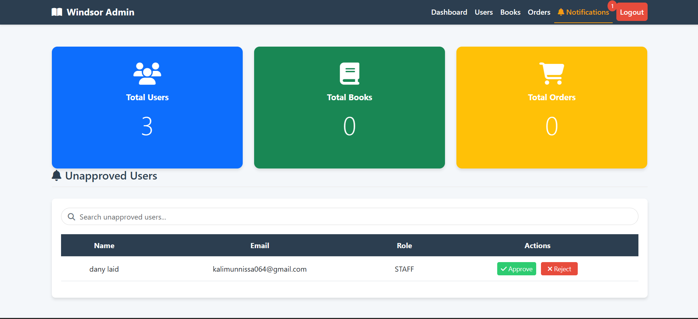
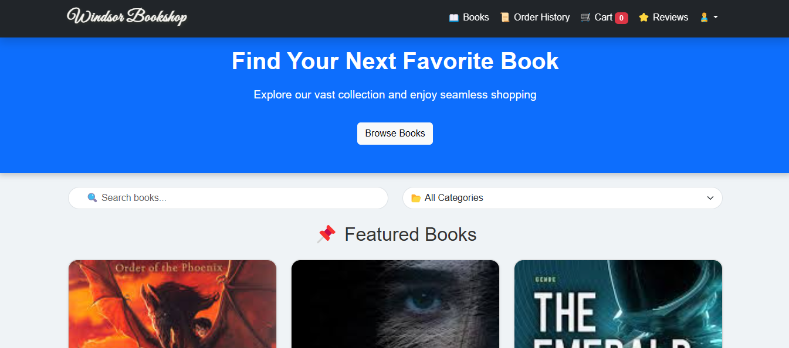
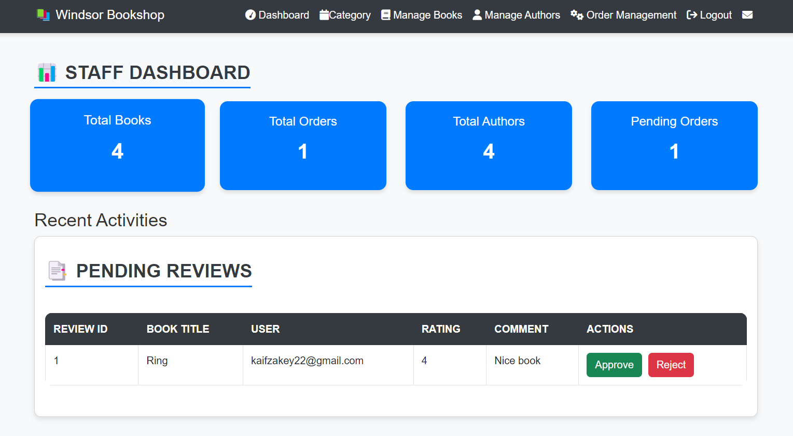
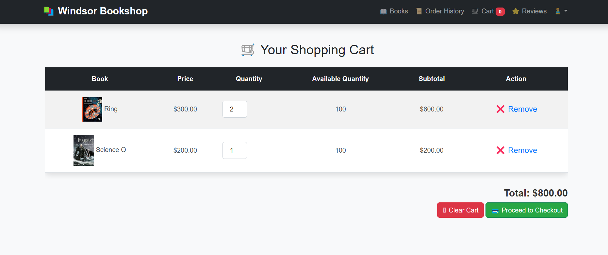
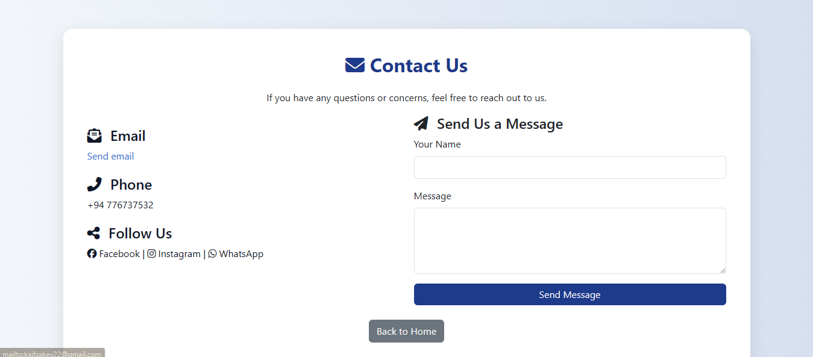
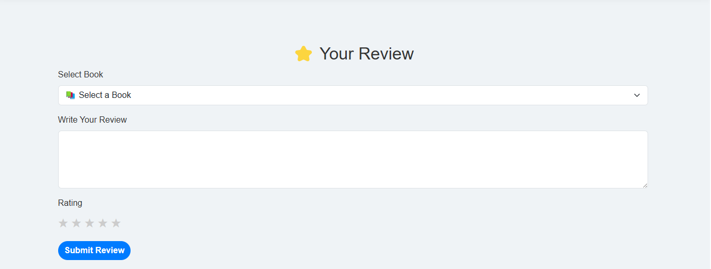
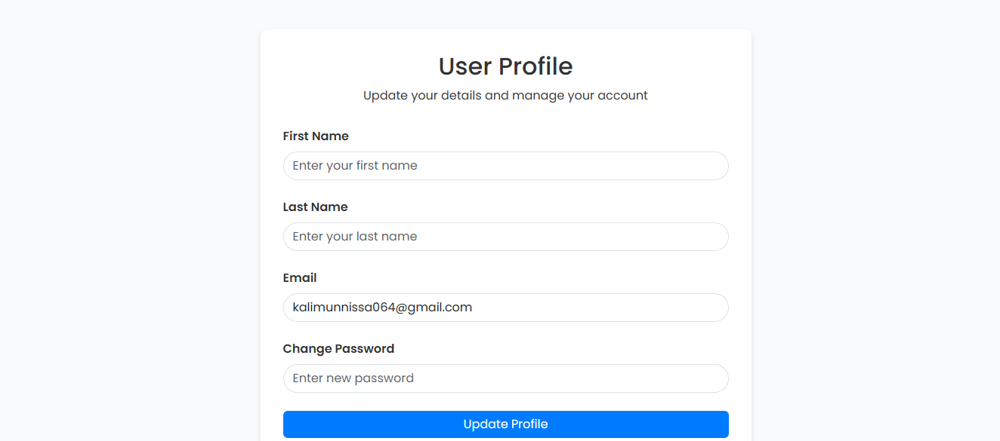

# Windsor Bookshop

---
## Project Description

- Windsor Bookshop
Windsor Bookshop is a full-featured, modern web-based bookshop management system built using Spring Boot and JavaScript.
It allows customers to browse, search, filter, and purchase books online, while providing staff/admin users with robust tools to manage books, 
categories, orders, and users.

- A Spring Boot-based BookShop  that integrates database, JWT authentication, and mail gateway for real-time notifications.

---

## Features

- User authentication with JWT
- PostgreSQL for data persistence
- Secure configuration using environment variables or `application.properties`

---

## Tech Stack

- Java + Spring Boot
- PostgreSQL
- JWT (JSON Web Tokens)
- mail Gateway API
- Maven

---

## Configure Environment

Create an `application.properties` file or use environment variables:

## Setup Instructions

This guide will walk you through the steps to install, configure, and run both the frontend and backend applications of the Windsor Book shop project.

---

### Prerequisites
Before you begin, ensure you have the following installed on your system:

#### Backend:

- Java Development Kit (JDK): Make sure you have a compatible JDK installed (ideally Java 11 or later, as typically used with Spring Boot). You can download it from [Oracle](https://www.oracle.com/java/technologies/downloads/?er=221886) or [OpenJDK](https://openjdk.org/).

- Maven: Spring Boot projects often use Maven for dependency management and building. Install Maven from [Apache Maven](https://maven.apache.org/download.cgi).
  
- MySQL: You will need a running MySQL database server. You can download and install it from [MySQL Community Downloads](https://dev.mysql.com/downloads/installer/).

  #### Frontend:

- Web Browser: A modern web browser (Chrome, Safari, Edge) to view the frontend application.

### Backend Setup
### 1. Navigate to the Backend Directory:
Open your terminal or command prompt and navigate to the backend/ folder within your project repository.

```bash
cd backend
```
 
 ### 2. Configure MySQL Database:

- Create a new database for the project (e.g., `windsorbookshop`).
- Update the database connection properties in the `src/main/resources/application.properties` or `application.yml` file. You will need to provide the following details:

```properties
spring.datasource.url=jdbc:mysql://localhost:3306/WindsorBookShop
spring.datasource.username=your_mysql_username
spring.datasource.password=your_mysql_password
spring.jpa.hibernate.ddl-auto=update
```
---

Replace `your_mysql_username` and `your_mysql_password` with your MySQL credentials.
`spring.jpa.hibernate.ddl-auto=update` will automatically create or update the database schema based on your JPA entities. For production, consider using a more controlled approach for schema management.

---

### 3. Build the Backend Application :
Use Maven to build the project. Run the following command in the `backend/` directory:  
```bash
mvn clean install
```


### 4. Run the Backend Application :
 After the build is successful, you can run the Spring Boot application using the following Maven command :
```bash
mvn clean install
```

Alternatively, you can find the generated `.jar` file in the `backend/target/` directory (e.g., `windsorbookshop-0.0.1-SNAPSHOT.jar`) and run it using:
```bash
java -jar target/windsorbookshop-0.0.1-SNAPSHOT.jar
```

### 5. Backend API URL :
 The backend API should be accessible at a base URL, typically `http://localhost:8080/api/v1`

 ## Demonstration Of the WindsorBookshop You Can Watch here:
 [WindsorBookshop Project video](https://youtu.be/xdA5sqPQ2iY)


## ScreenShots Of Windsor Project

### Admin Dashboard
 

 
 ### Customer Dashboard
 


  ### Staff Dashboard
 


 ### Cart
 


### Contact Us 
 


### Customer Review
 


### Order History
 


### Order Management
 
 

 ### User Profile
 

 
 

